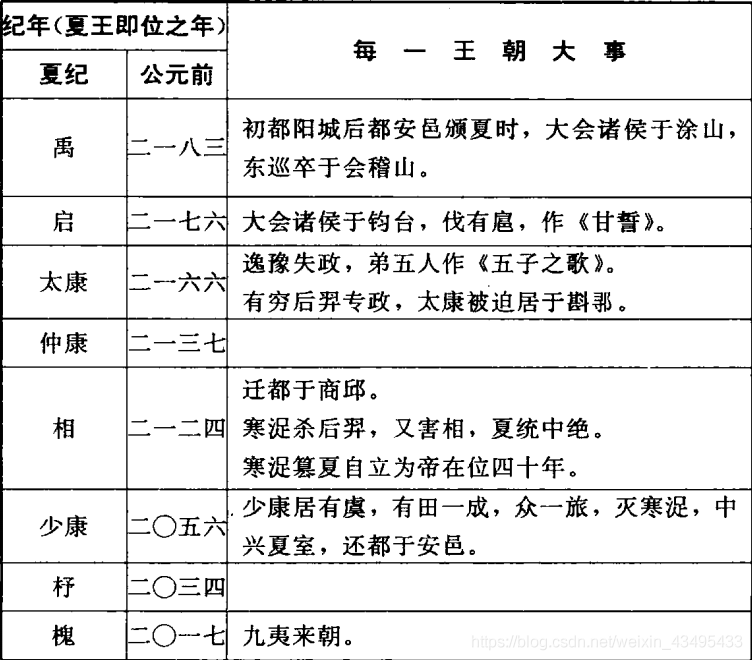
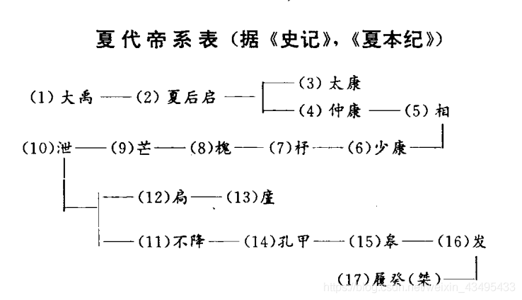
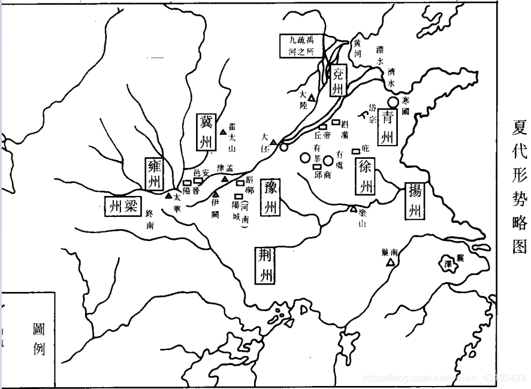

@[TOC](夏代)

# 夏国简介
帝舜去世,禹得到诸侯一致的拥护,继立为天子。他曾受舜封为夏伯,赐姓姒,故国号夏,建都安邑,他先后请皋陶与益佐理政事。禹的政治,一方面督励人民从事农耕;方面整伤社会秩序,法律很严。他从北而南巡视天下,曾大会诸侯于涂山。防风氏后到为禹所杀。史称执玉帛而来与会的有万国,执玉的是大国,执帛的是小国。这些诸侯也就是那个时候的氏族部落,足以说明禹声威之盛远过唐虞。他继续向东方巡视,行至中途,死在会稽山(今浙江绍兴东南),据说他的葬礼极其简单,所谓“桐棺三寸”、“衣衾三领”真是一生刻苦。禹死之后,有一段很短的时间,由益代行政事。后来诸侯,怀念禹功,都拥护禹子启而不拥护益。于是启继位为天子,从此建立了父子相传的君主制度。

# 夏代大事

史称:“帝尧之时洪水滔天,浩浩怀山襄陵。”成为当时最严重的一个问题叠经派人治理,都没有成功,尧乃接受四岳的推荐,用鲧治水,鲧就是禹的父亲。鲧用堵塞的方法,多筑堤坝。但是洪水滔滔,随筑随溃,经过九年的功夫,没有成功,引起人民的怨愤。到了舜执政的时候,便将鲧殛死。而用鲧子禹继续治水。这洪水之灾,从尧初算起已经几十年了。舜又命益与弃协助禹。禹伤父功不成,乃焦思苦虑。不惜一切的劳苦,希望能完成先业,以雪父耻。他完全改变他父亲的方法,从疏导着手。他带着许多“准绳”、“规矩”等测量的工具,登山涉水,观察地形高下,而后施工。他又用了许多交通工具,史称“陆行乘车,水行乘船,泥行乘橇,山行乘撵。”他先从黄河的中段冀州地方开始。这也是黄河泛滥的枢纽地带(今山西、河南之间)。一步步的向东方的兖州、青州、徐州、南方的荆州、豫州疏导,最后又折向西北去整理黄河的上游。他将黄河下游的河道分辟为九股,散其水势。然后再分为漯济流入渤海。又疏通了许多其他的河道,完成了许多惊人的工程。他率领人民,和黄河作了十三年的奋斗,把这上百年的洪水之灾,完全治平。使老百姓免于饥溺流离之苦,能在黄河流域安居乐业下来。他这十三年中,为了国家和人民,奋不顾身,曾经几次经过家门而不入。顾不得饮食起居,他治水时总是亲自拿着募锸以身作则带头去作。冒着狂风暴雨,弄得身体憔悴而永不休息。和他同样辛苦的,还有协助他的益(虞)和弃(后稷)。益掌火,在治水之前,纵火焚山林,以驱禽兽,弃为后稷,掌播谷。在水平之后,教人民耕种,从事善后工作。他们这样辛劳,一方面获得百姓的爱戴;一方面获得后世的崇拜,禹成为后来苦行家墨子的宗师。而禹与后稷,被孟子尊为是“历史上最富于同情心的人”。
    夏启继立后,曾大会诸侯于钧台(今河南禹县许昌之间)。有扈氏不服,启率兵与有扈战于甘(今作《甘誓》)灭有扈。夏启的政权,乃归稳定。正式称为“夏后启”,启在位九年卒,子太康立。太康逸豫失政,太康五弟,追思禹德,乃作《五子之歌》。这时有东夷地方的一个有穷氏诸侯后羿作乱,太康被逼迁于斟部(河南巩县附近)。太康传弟仲康,仲康传子相,相又一度迁都于商邱(河南商邱),夏朝实际成为后羿的政权,后来后羿又被其权臣寒浞所杀,寒浞又弑相而篡夏,夏自禹至相不到九十年,而国统几绝。相妻有缗氏怀孕在身,逃至有仍(今山东济宁),生了一个遗腹子,是为少康。少康既长,从有仍氏地方逃到虞地(河南虞城),投奔有虞氏,有虞氏君收纳了少康,给以田一成(方十里为成)、众旅(五百人为旅)。后来少康就凭藉着这一成一旅的资本,强大起来。收抚旧日夏朝的士众,灭掉寒浞,复兴夏朝,还都于安邑,史称少康中兴。这后羿、寒浞之乱前后历时百年。
少康时曾再度发生河患,以冥为司空再度治河。由少康传子杼,杼传槐(是为夏之第八主)。槐即位,九夷来朝,九夷畎夷、于夷、方夷、黄夷、白夷、赤夷、玄夷、风夷、阳夷)都是居住在东方滨海一带的落后民族。这说明在夏朝中叶的时候,夏朝的政教势力,已远达东海之滨。以前五帝到夏禹时,主要的异族战斗是苗、黎。苗、黎在西方。到夏时征服苗黎之后,继之以服九夷,说明夏人之向东发展。这个夏朝的中兴,为时约二百年,传到第十四个君主孔甲,淫乱无度,夏政再衰。诸侯纷纷叛离,中枢的权力,日益纷散,夏政乃一蹶不振。《周语》说:“孔甲乱夏,四世而陨”。夏代从孔甲乱政,以后三传到了履癸,履癸先都斟郛,后都河南禹县)。这履癸就是夏桀,种种无道,荒淫奢侈。传说夏桀宠爱有施氏之女妹喜,又宠爱岷山氏二女琬、琰。又营建倾宫瑶台,作酒池肉林,杀忠臣关龙逢。太史令终古哭谏夏桀,夏桀不听,终古就亡奔于商。商人是东方的一个诸侯,世居于今安徽亳县到河南商邱一带的地方。从孔甲失德以后,商人逐渐壮大,逐渐获得诸侯的拥护。到了商汤的时候,诸侯多叛桀而归汤。有些诸侯不服从汤,汤出兵去讨伐。兵行所到之处,百姓无不欢迎。其威德远在夏桀之上。就在夏桀在位的第五十三年(公元前一七五一年),商汤俯顺舆情,率领诸侯之兵,讨伐夏桀。与夏桀大战于鸣条(旧说在山西安邑附近,近人考应在淮河之南),夏桀大败。向东南方逃走,被商汤一路追击。夏桀屡战屡败,终被商汤所俘。商汤就把夏桀流放在南巢(安徽巢县),三年而死,史称“商汤革命”。这是我国历史上第一次的贵族革命。这个夏朝,也是中国历史上第一个正式的朝代。凡历十四世,十七主,四百余年而亡。

# 夏代影响

 1.  治水
禹治水的范围极大,据旧《史记》载,所谓疏“三江五湖”,几乎遍于全国,除了黄河之外,又导黄河的支流济水,又导淮水,又导长江。江、淮、河、济谓之四渎,所谓“四渎修,而民宅安。”我们近人推断,在那个时候,治水范围不会如此之广。我们可相信的是大禹的治水,是以黄河中段的冀州豫州为主。而渐及东方的兖州、徐州、可能的上溯到黄河上游的雍州、梁州和荆州的一部分。其他淮水与长江北面的若干支流。也可能附带的疏导过。然而仅这一个估计的范围已经很大,已经是禹率领着千万人民,经过十几年才能完成的功业。大禹治水的目的,是谋求人民生活的安定,使人民生活安定最好的方法,是使人民在这片新整理的土地上从事农耕。所以大禹治水后,就由弃的协助展开全面的农村建设,从夏朝起中国正式成为一个农业的国家。又由于治河的结果,自然而然的了解到各地的地势物产、风俗人情,自然171中华通史·第一卷·绪论上古史而然的加强了中央与地方及人民的联系。于是他制定了一个政治的区划,这个区划是分全国为九州。这九州是雍州(约当今陕西之地)、冀州(约当今山西南部)、豫州(约当今河南)、兖州(约当今河北南部)、青州(约当今山东)、徐州约当今苏北、皖北)、扬州(约当今皖南、苏南)、荆州(约当今豫南与湖北)梁州〔约当今陕南)成为中国版图的基础。
    又分为全国为五服(以王畿为中心,王畿四周五百里内为甸服,五百里外为侯服,侯服外五百里为绥服,绥服外五百里为要服,要服外五百里为荒服),构成一个以王京为中心的空间观念。又根据各地的物产,制为九等贡赋。此孟子所谓“夏后氏五十而贡”。这就是禹贡九州。所以由于大禹的治水的结果,他奠定了中国的农业社会;他建立了中国的疆域概念。他是最早建立中华民族成为一个国家的大英雄。禹称夏后氏,“夏”便成为我民族对外之代名辞。按《说文》“夏”字“”作人形,注云:“中国人也”(因之,当时中国境内诸民族,称为诸夏)。故后人称禹为大禹,诚非偶然。

 2. 大禹始称王,始定传子之局。
    以前五帝的共主称氏,以前虞舜的禅让,均未脱氏族的形态。到了夏禹以后传子称王,证明中央的权威提高。诸侯对于中央的关系更加服从,更加密切。中央王室的政权更加稳定,更进一步走向封建帝国。按人类上古史的演变,由最早的部落到封建的君主世袭,这是一个大的进步,这是一个国家组织的完成。我们看禹时诸侯大会涂山,诛防风氏。启时大会诸侯钓台,诛有扈氏。都是说明这个国家组织与中央政府权力的扩大。

 3. 治水成功,推进农业。
夏人建国后配合农时而制订以建寅为岁首(正月)的历法。最合乎农业的时序,周人称夏人为“得天”。这个“夏正”历法,在商、周、秦时一度改变,到汉以后又恢复采用直用到今天,就是那四序分明的阴历,我们又叫做农历。由于夏禹的治水兴农,而建立了“农历”。我们又由这“农历”,可以推想到夏朝的农业社会。因为这“夏正”,是最符合农业的一个时序。
夏代的文化已入于铜器时代。我们现在出土的铜器,虽尚未有确切的文字足以证明是夏代的铜器。但在山西、河南带若干出土的铜器中,相信其中或有夏器,并且根据殷商铜器之精美,其铜器制造,一定为时已久,则上推两三百年在夏朝时定有铜器可无疑。禹铸九鼎之说见于《史记》、《说文》、《左传》、《墨子》诸书,自然不是虚构。并且自春秋到秦汉历代有求鼎之事,绝对不是毫无根据的狂妄举动。据说禹铸九鼎是集九牧之铜铸成,上面刻划着各地的方物所谓铸鼎象物”。看了这九鼎,就可以知道九州的产物情形,这和《禹贡》的制度正相配合。这九鼎一直成为传国重器,也就是国家的象征。

> 本文内容均抄录于[中华通史.上古史]，致谢陈致平先生