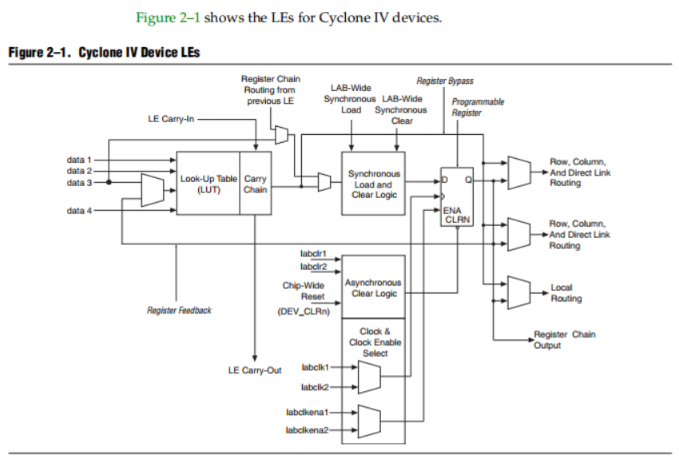
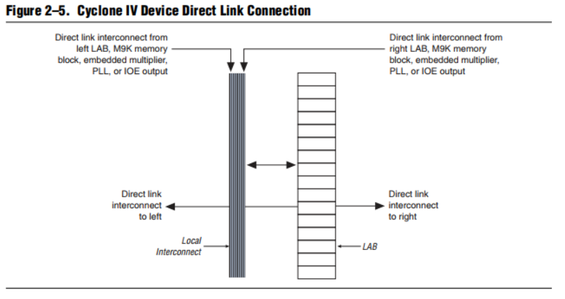
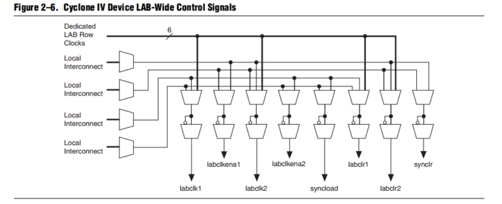

# Logic Elements and Logic Array Blocks in Cyclone IV Devices (LCyclone IV器件中的逻辑元件和逻辑阵列块)
This chapter contains feature definitions for logic elements (LEs) and logic array blocks (LABs). Details are provided on how LEs work, how LABs contain groups of LEs, and how LABs interface with the other blocks in Cyclone® IV devices.
>这一章包含了Cyclone® IV器件中逻辑元件（LEs）和逻辑阵列块（LABs）的特性定义。详细介绍了LEs的工作原理、LABs如何包含LEs的组群，以及LABs如何与Cyclone® IV器件中的其他模块进行接口。

## Logic Elements (逻辑元件)
Logic elements (LEs) are the smallest units of logic in the Cyclone IV device
architecture. LEs are compact and provide advanced features with efficient logic
usage. Each LE has the following features:
>逻辑元件（LEs）是Cyclone IV器件架构中最小的逻辑单元。LEs紧凑而且提供高效的逻辑使用，具有先进的功能。每个LE具有以下特性：

■ A four-input look-up table (LUT), which can implement any function of four
variables
■ A programmable register
■ A carry chain connection
■ A register chain connection
■ The ability to drive the following interconnects:
■ ■ Local
■ ■ Row
■ ■ Column
■ ■ Register chain
■ ■ Direct link
■ Register packing support
■ Register feedback support

>- 一个四输入查找表（LUT），可以实现四个变量的任何函数
>- 一个可编程寄存器
>- 一个进位链连接
>- 一个寄存器链连接
>- 能够驱动以下互连方式：
>  -- 本地
>  -- 行
>  -- 列
>  -- 寄存器链
>  -- 直接链接
>  - 寄存器打包支持
>  - 寄存器反馈支持

### LE Features(LE特性)
You can configure the programmable register of each LE for D, T, JK, or SR flipflop
operation. Each register has data, clock, clock enable, and clear inputs. Signals that use the global clock network, general-purpose I/O pins, or any internal logic can drive the clock and clear control signals of the register. Either general-purpose I/O pins or the internal logic can drive the clock enable. For combinational functions, the LUT output bypasses the register and drives directly to the LE outputs. 
Each LE has three outputs that drive the local, row, and column routing resources. The LUT or register output independently drives these three outputs. Two LE outputs drive the column or row and direct link routing connections, while one LE drives the local interconnect resources. This allows the LUT to drive one output while the register drives another output. This feature, called register packing, improves device utilization because the device can use the register and the LUT for unrelated functions. The LAB-wide synchronous load control signal is not available when using register packing. For more information about the synchronous load control signal, refer to “LAB Control Signals” on page 2–6. 
The register feedback mode allows the register output to feed back into the LUT of the same LE to ensure that the register is packed with its own fan-out LUT, providing another mechanism for improved fitting. The LE can also drive out registered and unregistered versions of the LUT output. 
In addition to the three general routing outputs, LEs in an LAB have register chain outputs, which allows registers in the same LAB to cascade together. The register chain output allows the LUTs to be used for combinational functions and the registers to be used for an unrelated shift register implementation. These resources speed up connections between LABs while saving local interconnect resources.

>每个LE的可编程寄存器可以配置为D、T、JK或SR触发器操作。每个寄存器都有数据、时钟、时钟使能和清除输入。使用全局时钟网络、通用I/O引脚或任何内部逻辑的信号都可以驱动寄存器的时钟和清除控制信号。通用I/O引脚或内部逻辑都可以驱动时钟使能。对于组合功能，查找表（LUT）输出会绕过寄存器，直接驱动LE的输出。每个LE有三个输出，分别驱动本地、行和列的路由资源。LUT或寄存器输出可以独立地驱动这三个输出。两个LE输出驱动列或行以及直接链接的路由连接，而一个LE驱动本地互连资源。这允许LUT驱动一个输出，而寄存器驱动另一个输出。这个特性被称为**寄存器打包**，它提高了器件的利用率，因为器件可以同时使用寄存器和LUT来执行不相关的功能。当使用寄存器打包时，整个LAB范围的同步加载控制信号不可用。有关同步加载控制信号的更多信息，请参阅第2-6页上的“LAB控制信号”。**寄存器反馈模式**允许寄存器输出反馈到同一LE的LUT中，以确保寄存器与其自身的扇出LUT一起打包，提供了另一种改善适配的机制。LE还可以驱动经过寄存器和未经过寄存器的LUT输出。
除了三个通用的路由输出之外，同一个LAB中的LE还具有寄存器链输出，这使得同一个LAB中的寄存器可以级联在一起。寄存器链输出允许LUT用于组合功能，而寄存器用于不相关的移位寄存器实现。这些资源加速了LAB之间的连接，同时节省了本地互连资源。

## LE Operating Modes（LE操作模式）
Cyclone IV LEs operate in the following modes:
>Cyclone IV中的LE有以下操作模式：

■ Normal mode
■ Arithmetic mode
>普通模式
算术模式

The Quartus® II software automatically chooses the appropriate mode for common
functions, such as counters, adders, subtractors, and arithmetic functions, in
conjunction with parameterized functions such as the library of parameterized
modules (LPM) functions. You can also create special-purpose functions that specify
which LE operating mode to use for optimal performance, if required
>Quartus® II软件会自动选择适用于常见功能（如计数器、加法器、减法器和算术函数）的适当模式，与参数化功能（如参数化模块库（LPM）函数）结合使用。如果需要，您还可以创建特殊用途的功能，明确指定LE操作模式以实现最佳性能

### Normal Mode(普通模式)
Normal mode is suitable for general logic applications and combinational functions.
In normal mode, four data inputs from the LAB local interconnect are inputs to a
four-input LUT (Figure 2–2). The Quartus II Compiler automatically selects the
carry-in (cin) or the data3 signal as one of the inputs to the LUT. LEs in normal mode support packed registers and register feedback.
>普通模式适用于一般逻辑应用和组合功能。在普通模式下，来自LAB本地互连的四个数据输入是四输入查找表（LUT）的输入（图2–2）。Quartus II编译器会自动选择进位输入（cin）或data3信号作为LUT的输入之一。普通模式下的LE支持寄存器打包和寄存器反馈

### Arithmetic Mode(算术模式)
Arithmetic mode is ideal for implementing adders, counters, accumulators, and comparators. An LE in arithmetic mode implements a 2-bit full adder and basic carry
chain (Figure 2–3). LEs in arithmetic mode can drive out registered and unregistered versions of the LUT output. Register feedback and register packing are supported when LEs are used in arithmetic mode.
>算术模式非常适合实现加法器、计数器、累加器和比较器。在算术模式下，LE实现一个2位全加器和基本的进位链（图2–3）。在算术模式下的LE可以输出经过寄存器和未经寄存器的LUT输出版本。当LE在算术模式下使用时，支持寄存器反馈和寄存器打包。

The Quartus II Compiler automatically creates carry chain logic during design
processing. You can also manually create the carry chain logic during design entry.
Parameterized functions, such as LPM functions, automatically take advantage of
carry chains for the appropriate functions.
>Quartus II编译器在设计处理过程中会自动创建进位链逻辑。您也可以在设计输入期间手动创建进位链逻辑。参数化函数，如LPM函数，会自动利用适当的功能的进位链。

The Quartus II Compiler creates carry chains longer than 16 LEs by automatically linking LABs in the same column. For enhanced fitting, a long carry chain runsvertically, which allows fast horizontal connections to M9K memory blocks orembedded multipliers through direct link interconnects. For example, if a design has a long carry chain in an LAB column next to a column of M9K memory blocks, any LE output can feed an adjacent M9K memory block through the direct link interconnect. If the carry chains run horizontally, any LAB which is not next to the column of M9K memory blocks uses other row or column interconnects to drive a M9K memory block. A carry chain continues as far as a full column.
>Quartus II编译器通过自动连接同一列中的LAB来创建长度超过16个LE的进位链。为了增强适配性，一个长的进位链垂直运行，允许通过直接链接互连快速水平连接到M9K存储器块或嵌入式乘法器。例如，如果设计在与M9K存储器块相邻的LAB列中有一个长的进位链，任何LE输出都可以通过直接链接互连馈送到相邻的M9K存储器块。如果进位链水平运行，不与M9K存储器块列相邻的任何LAB都会使用其他行或列互连来驱动M9K存储器块。进位链会一直延伸到整个列。

## Logic Array Blocks(逻辑阵列块)
Logic array blocks (LABs) contain groups of LEs.
>逻辑阵列块（LABs）包含LE的组群
### Topology(拓扑结构)
Each LAB consists of the following features:
■ 16 LEs
■ LAB control signals
■ LE carry chains
■ Register chains
■ Local interconnect
The local interconnect transfers signals between LEs in the same LAB. Register chain connections transfer the output of one LE register to the adjacent LE register in an LAB. The Quartus II Compiler places associated logic in an LAB or adjacent LABs, allowing the use of local and register chain connections for performance and area efficiency.
>每个LAB包括以下特性：
--16个LE
--LAB控制信号
--LE进位链
--寄存器链
--本地互连
本地互连在同一LAB中的LE之间传递信号。寄存器链连接将一个LE寄存器的输出传递到相邻LAB中的另一个LE寄存器。Quartus II编译器将相关逻辑放置在一个LAB或相邻的LAB中，从而允许使用本地和寄存器链连接以提高性能和节省面积。

### LAB Interconnects(LAB互连)
The LAB local interconnect is driven by column and row interconnects and LE
outputs in the same LAB. Neighboring LABs, phase-locked loops (PLLs), M9K RAM
blocks, and embedded multipliers from the left and right can also drive the local
interconnect of a LAB through the direct link connection. The direct link connection feature minimizes the use of row and column interconnects, providing higher performance and flexibility. Each LE can drive up to 48 LEs through fast local and direct link interconnects.
>LAB本地互连由同一LAB中的列和行互连以及LE输出驱动。相邻的LAB、锁相环（PLL）、M9K RAM块和来自左侧和右侧的嵌入式乘法器也可以通过直接链接连接驱动LAB的本地互连。直接链接连接功能最小化了行和列互连的使用，提供更高的性能和灵活性。每个LE可以通过快速的本地和直接链接互连驱动最多48个LE。

### LAB Control Signals(LAB控制信号)
Each LAB contains dedicated logic for driving control signals to its LEs. The control signals include:
>每个LAB都包含专用逻辑，用于向其LE驱动控制信号。这些控制信号包括：

■ Two clocks
■ Two clock enables
■ Two asynchronous clears
■ One synchronous clear
■ One synchronous load
>两个时钟
两个时钟使能
两个异步清除
一个同步清除
一个同步加载

You can use up to eight control signals at a time. Register packing and synchronous
load cannot be used simultaneously.
>您可以同时使用最多八个控制信号。寄存器打包和同步加载不能同时使用。

Each LAB can have up to four non-global control signals. You can use additional LAB
control signals as long as they are global signals.
>每个LAB最多可以有四个非全局控制信号。只要它们是全局信号，您可以使用额外的LAB控制信号。

Synchronous clear and load signals are useful for implementing counters and other
functions. The synchronous clear and synchronous load signals are LAB-wide signals
that affect all registers in the LAB.
>同步清除和同步加载信号对于实现计数器和其他功能非常有用。同步清除和同步加载信号是LAB范围的信号，影响LAB中的所有寄存器。

Each LAB can use two clocks and two clock enable signals. The clock and clock enable signals of each LAB are linked. For example, any LE in a particular LAB using the labclk1 signal also uses the labclkena1. If the LAB uses both the rising and falling edges of a clock, it also uses both LAB-wide clock signals. Deasserting the clock enable signal turns off the LAB-wide clock.
>每个LAB可以使用两个时钟和两个时钟使能信号。每个LAB的时钟和时钟使能信号是关联的。例如，使用labclk1信号的特定LAB中的任何LE也使用labclkena1。如果LAB同时使用上升沿和下降沿的时钟，它还会使用两个LAB范围的时钟信号。取消时钟使能信号将关闭LAB范围的时钟。

The LAB row clocks [5..0] and LAB local interconnect generate the LAB-wide
control signals. The MultiTrack interconnect inherent low skew allows clock and
control signal distribution in addition to data distribution.
>LAB行时钟[5..0]和LAB本地互连生成LAB范围的控制信号。MultiTrack互连固有的低斜率允许时钟和控制信号的分发，除了数据分发。

LAB-wide signals control the logic for the clear signal of the register. The LE directly supports an asynchronous clear function. Each LAB supports up to two asynchronous clear signals (labclr1 and labclr2).
>LAB范围的信号控制寄存器的清除信号逻辑。LE直接支持异步清除功能。每个LAB支持最多两个异步清除信号（labclr1和labclr2）。

A LAB-wide asynchronous load signal to control the logic for the preset signal of the register is not available. The register preset is achieved with a NOT gate push-back technique. Cyclone IV devices only support either a preset or asynchronous clear signal.
>LAB范围的异步加载信号，用于控制寄存器的预设信号逻辑，是不可用的。寄存器的预设是通过NOT门推迟技术实现的。Cyclone IV器件仅支持预设或异步清除信号的一种。

In addition to the clear port, Cyclone IV devices provide a chip-wide reset pin
(DEV_CLRn) that resets all registers in the device. An option set before compilation in the Quartus II software controls this pin. This chip-wide reset overrides all other control signals.
>除了清除端口，Cyclone IV器件提供一个芯片范围的复位引脚（DEV_CLRn），用于复位设备中的所有寄存器。在Quartus II软件中编译之前设置的选项控制此引脚。这个芯片范围的复位会覆盖所有其他控制信号。